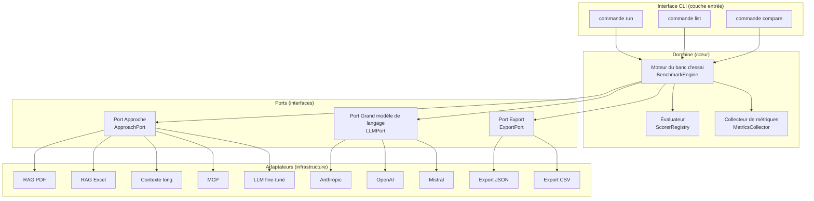

# Document de Design — `llm-benchmark`

## Vue d'ensemble

`medical-llm-benchmark` est un cadre d'évaluation Python structuré autour de l'architecture hexagonale (ports et adaptateurs). Il permet de croiser des **approches** (RAG PDF, RAG Excel, contexte long, MCP, grand modèle de langage fine-tuné) avec des **grands modèles de langage** (Mistral, Claude, GPT, etc.) sur un **jeu de données** de questions médicales standardisées, et de mesurer objectivement leur précision, leur sourçage et leurs métriques opérationnelles.

Le premier jeu de données concret est celui de la SFAR sur l'antibioprophylaxie chirurgicale (RFE 2024), mais l'architecture permet d'ajouter d'autres domaines sans modifier le cœur du système.

### Objectifs de design

- **Extensibilité** : ajouter une approche, un grand modèle de langage ou un format d'export = implémenter un adaptateur, pas modifier le moteur.
- **Reproductibilité** : chaque exécution est identifiée, horodatée, et ses paramètres complets sont enregistrés.
- **Déterminisme** : l'évaluation (évaluateur) est pure et sans état ; les mêmes entrées produisent toujours les mêmes sorties.
- **Observabilité** : métriques opérationnelles (latence, jetons, coût, empreinte carbone) collectées à chaque question.
- **Simplicité** : CLI directe, configuration YAML pour les cas simples, Python pour les cas complexes.

---

## Architecture

L'architecture suit le modèle **hexagonal (ports et adaptateurs)** : le domaine métier (moteur du banc d'essai, évaluateurs, modèles de données) est isolé des détails d'infrastructure (appels API, fichiers, CLI).



### Séparation des responsabilités

| Couche | Responsabilité | Dépendances |
|--------|---------------|-------------|
| Domaine | Orchestration, évaluation, métriques | Aucune dépendance externe |
| Ports | Contrats d'interface (ABC Python) | Domaine uniquement |
| Adaptateurs | Implémentations concrètes | Bibliothèques tierces (anthropic, openai, etc.) |
| CLI | Parsing des arguments, affichage | Domaine + adaptateurs |

### Structure de répertoires cible

```
src/
  llm_benchmark/
    domain/
      entities.py        ← Entités du domaine (dataclasses)
      value_objects.py   ← Objets valeur (Cost, Latency, Accuracy, etc.)
      engine.py          ← Moteur du banc d'essai
      scorer.py          ← Évaluateurs (open, QCM, sourçage)
      metrics.py         ← Collecteur de métriques
    ports/
      approach.py        ← Port Approche (ABC)
      llm.py             ← Port Grand modèle de langage (ABC)
      export.py          ← Port Export (ABC)
    adapters/
      approaches/
        rag_pdf.py
        rag_excel.py
        long_context.py
        mcp.py
        finetuned.py
      llms/
        litellm.py       ← Adaptateur LiteLLM (tous providers)
      exports/
        json_export.py
        csv_export.py
    config/
      loader.py          ← Chargement YAML + validation
    cli/
      main.py            ← Point d'entrée CLI (argparse)
datasets/
  sfar_antibioprophylaxie/
    benchmark.json       ← Jeu de données SFAR (migré depuis research/)
    metadata.yaml        ← Métadonnées du jeu de données
tests/
  unit/
  property/
  integration/
```

---

## Composants et interfaces

### Port Approche (`ApproachPort`)

```python
from abc import ABC, abstractmethod
from llm_benchmark.domain.models import Question, ApproachResponse
from llm_benchmark.domain.value_objects import ApproachId

class ApproachPort(ABC):
    """Port définissant le contrat d'une approche d'accès à la connaissance."""

    @property
    @abstractmethod
    def approach_id(self) -> ApproachId:
        """Identifiant unique de l'approche (ex: 'rag-pdf', 'long-context')."""

    @abstractmethod
    def build_prompt(self, question: Question) -> str:
        """Construit l'invite à envoyer au grand modèle de langage."""

    @abstractmethod
    def prepare(self) -> None:
        """Initialise les ressources nécessaires (index, connexions, etc.)."""
```

### Port Grand modèle de langage (`LLMPort`)

```python
from abc import ABC, abstractmethod
from llm_benchmark.domain.models import LLMRequest, LLMResponse
from llm_benchmark.domain.value_objects import ModelId, Cost

class LLMPort(ABC):
    """Port définissant le contrat d'appel à un grand modèle de langage."""

    @property
    @abstractmethod
    def model_id(self) -> ModelId:
        """Identifiant du modèle (ex: 'claude-sonnet-4', 'gpt-4o')."""

    @property
    @abstractmethod
    def price_per_input_token(self) -> Cost:
        """Tarif par jeton d'entrée."""

    @property
    @abstractmethod
    def price_per_output_token(self) -> Cost:
        """Tarif par jeton de sortie."""

    @abstractmethod
    def complete(self, request: LLMRequest) -> LLMResponse:
        """Envoie une invite et retourne la réponse avec métriques brutes."""
```

### Port Export (`ExportPort`)

```python
from abc import ABC, abstractmethod
from pathlib import Path
from llm_benchmark.domain.models import RunResult

class ExportPort(ABC):
    """Port définissant le contrat de sérialisation d'un résultat d'exécution."""

    @abstractmethod
    def export(self, result: RunResult, output_dir: Path) -> Path:
        """Sérialise le résultat et retourne le chemin du fichier créé."""
```

### Moteur du banc d'essai (`BenchmarkEngine`)

Le moteur orchestre une exécution : pour chaque combinaison (approche × grand modèle de langage), il itère sur les questions, délègue la construction de l'invite à l'approche, l'appel au grand modèle de langage au port LLM, l'évaluation à l'évaluateur, et la collecte des métriques au collecteur.

```python
class BenchmarkEngine:
    def run(
        self,
        dataset: Dataset,
        approaches: list[ApproachPort],
        llms: list[LLMPort],
        question_ids: list[QuestionId] | None = None,
    ) -> list[RunResult]: ...
```

### Évaluateur (`ScorerRegistry`)

Registre d'évaluateurs indexés par type de question. Chaque évaluateur est une fonction pure `(expected: str, actual: str) -> ScoreResult`.

- `OpenScorer` : normalisation + correspondance de molécules
- `QCMScorer` : extraction de lettre A–D + comparaison exacte
- `SourcingScorer` : détection de référence + correspondance à la source attendue

### Adaptateur LLM (`LiteLLMAdapter`)

Plutôt que d'implémenter un adaptateur par provider (Anthropic, OpenAI, Mistral...), on utilise [LiteLLM](https://github.com/BerriAI/litellm) comme couche d'abstraction unifiée. Un seul `LiteLLMAdapter(LLMPort)` supporte 100+ modèles via une interface identique.

```python
import litellm
from llm_benchmark.ports.llm import LLMPort
from llm_benchmark.domain.entities import LLMRequest, LLMResponse
from llm_benchmark.domain.value_objects import ModelId, Cost, Latency

class LiteLLMAdapter(LLMPort):
    """Adaptateur LLM universel via LiteLLM."""

    def __init__(self, model: str, price_per_input_token: Cost, price_per_output_token: Cost):
        self._model_id = ModelId(model)
        self._price_in = price_per_input_token
        self._price_out = price_per_output_token

    @property
    def model_id(self) -> ModelId:
        return self._model_id

    @property
    def price_per_input_token(self) -> Cost:
        return self._price_in

    @property
    def price_per_output_token(self) -> Cost:
        return self._price_out

    def complete(self, request: LLMRequest) -> LLMResponse:
        import time
        start = time.perf_counter()
        response = litellm.completion(
            model=self._model_id.value,
            messages=[
                {"role": "system", "content": request.system_prompt},
                {"role": "user", "content": request.user_prompt},
            ],
            max_tokens=request.max_tokens,
        )
        latency = Latency(time.perf_counter() - start)
        return LLMResponse(
            text=response.choices[0].message.content,
            input_tokens=response.usage.prompt_tokens,
            output_tokens=response.usage.completion_tokens,
            latency=latency,
            raw=response.model_dump(),
        )
```

Les tarifs par modèle sont déclarés dans un fichier YAML de configuration (`config/models.yaml`), chargé par `ConfigLoader`.

Collecte latence, jetons, coût estimé, et empreinte carbone (via CodeCarbon). Chaque métrique est optionnelle : si le grand modèle de langage ne l'expose pas, la valeur est `null`.

---

## Objets valeur (Value Objects)

Les objets valeur encapsulent les primitives à sémantique métier forte. Ils sont immuables (`frozen=True`) et valident leurs invariants à la construction.

```python
from dataclasses import dataclass

@dataclass(frozen=True)
class Cost:
    """Coût monétaire avec devise explicite."""
    amount: float
    currency: str = "USD"  # "USD" | "EUR"

    def __post_init__(self):
        if self.amount < 0:
            raise ValueError(f"Cost cannot be negative: {self.amount}")
        if self.currency not in ("USD", "EUR"):
            raise ValueError(f"Unsupported currency: {self.currency}")

@dataclass(frozen=True)
class Latency:
    """Latence en secondes."""
    seconds: float

    def __post_init__(self):
        if self.seconds < 0:
            raise ValueError(f"Latency cannot be negative: {self.seconds}")

@dataclass(frozen=True)
class CarbonFootprint:
    """Empreinte carbone en grammes de CO2 équivalent."""
    g_co2e: float

    def __post_init__(self):
        if self.g_co2e < 0:
            raise ValueError(f"Carbon footprint cannot be negative: {self.g_co2e}")

@dataclass(frozen=True)
class Accuracy:
    """Précision entre 0.0 et 1.0."""
    value: float

    def __post_init__(self):
        if not 0.0 <= self.value <= 1.0:
            raise ValueError(f"Accuracy must be between 0 and 1: {self.value}")

    @property
    def as_percent(self) -> float:
        return self.value * 100

@dataclass(frozen=True)
class ModelId:
    """Identifiant d'un grand modèle de langage."""
    value: str

    def __post_init__(self):
        if not self.value.strip():
            raise ValueError("ModelId cannot be empty")

@dataclass(frozen=True)
class ApproachId:
    """Identifiant d'une approche."""
    value: str

    def __post_init__(self):
        if not self.value.strip():
            raise ValueError("ApproachId cannot be empty")

@dataclass(frozen=True)
class DatasetId:
    """Identifiant d'un jeu de données."""
    value: str

    def __post_init__(self):
        if not self.value.strip():
            raise ValueError("DatasetId cannot be empty")

@dataclass(frozen=True)
class RunId:
    """Identifiant unique d'une exécution (UUID)."""
    value: str

    def __post_init__(self):
        if not self.value.strip():
            raise ValueError("RunId cannot be empty")

@dataclass(frozen=True)
class QuestionId:
    """Identifiant d'une question dans un jeu de données."""
    value: str

    def __post_init__(self):
        if not self.value.strip():
            raise ValueError("QuestionId cannot be empty")


@dataclass(frozen=True)
class DatasetVersion:
    """Version d'un jeu de données."""
    value: str

    def __post_init__(self):
        if not self.value.strip():
            raise ValueError("DatasetVersion cannot be empty")


@dataclass(frozen=True)
class Source:
    """Référence bibliographique ou identifiant de source."""
    value: str

    def __post_init__(self):
        if not self.value.strip():
            raise ValueError("Source cannot be empty")


@dataclass(frozen=True)
class MCQChoices:
    """Choix de réponse pour une question QCM (clés A–D)."""
    choices: dict[str, str]

    def __post_init__(self):
        valid_keys = {"A", "B", "C", "D"}
        if not self.choices:
            raise ValueError("MCQChoices cannot be empty")
        invalid = set(self.choices.keys()) - valid_keys
        if invalid:
            raise ValueError(f"Invalid MCQ keys: {invalid}")


class QuestionType(Enum):
    """Type d'une question dans un jeu de données."""
    OPEN = "open"
    MCQ = "mcq"
```

---

## Entités du domaine

```python
from dataclasses import dataclass, field
from enum import Enum
from typing import Any
from datetime import datetime
from llm_benchmark.domain.value_objects import (
    Cost, Latency, CarbonFootprint, Accuracy, ModelId, ApproachId,
    DatasetId, RunId, QuestionId, QuestionType, DatasetVersion,
    Source, MCQChoices
)

@dataclass
class Question:
    id: QuestionId
    type: QuestionType
    question: str
    réponse: str
    source: Source | None = None
    choix: MCQChoices | None = None   # QCM uniquement

@dataclass
class Dataset:
    id: DatasetId
    version: DatasetVersion
    source: Source
    scope: str
    questions: list[Question]

@dataclass
class LLMRequest:
    system_prompt: str
    user_prompt: str
    max_tokens: int = 300

@dataclass
class LLMResponse:
    text: str
    input_tokens: int | None = None
    output_tokens: int | None = None
    latency: Latency | None = None
    raw: dict[str, Any] = field(default_factory=dict)

@dataclass
class ScoreResult:
    correct: bool
    sourcing_present: bool = False
    sourcing_correct: bool = False
    details: dict[str, Any] = field(default_factory=dict)

@dataclass
class QuestionResult:
    question_id: QuestionId
    question_type: QuestionType
    expected: str
    actual: str | None
    score: ScoreResult | None
    latency: Latency | None = None
    input_tokens: int | None = None
    output_tokens: int | None = None
    cost: Cost | None = None
    error: str | None = None

@dataclass
class RunSummary:
    total: int
    correct: int
    accuracy: Accuracy
    sourcing_rate: Accuracy
    sourcing_correct_rate: Accuracy
    total_cost: Cost | None
    total_tokens: int | None
    avg_latency: Latency | None
    carbon_footprint: CarbonFootprint | None
    by_type: dict[str, dict[str, Any]]

@dataclass
class RunResult:
    run_id: RunId
    timestamp: datetime
    dataset_id: DatasetId
    dataset_version: str
    approach_id: ApproachId
    model_id: ModelId
    framework_version: str
    config: dict[str, Any]
    summary: RunSummary
    results: list[QuestionResult]
```

### Schéma JSON de sortie (extrait)

```json
{
  "run_id": "a1b2c3d4-...",
  "timestamp": "2025-01-15T10:30:00Z",
  "dataset_id": "sfar-antibioprophylaxie",
  "dataset_version": "1.0",
  "approach_id": "rag-pdf",
  "model_id": "claude-sonnet-4",
  "framework_version": "0.1.0",
  "config": { "max_tokens": 300 },
  "summary": {
    "total": 25,
    "correct": 20,
    "accuracy": 0.80,
    "sourcing_rate": 0.72,
    "sourcing_correct_rate": 0.60,
    "total_cost_usd": 0.042,
    "total_tokens": 12500,
    "avg_latency_s": 1.8,
    "carbon_g_co2e": 0.15,
    "by_type": {
      "open": { "total": 18, "correct": 15, "accuracy": 0.833 },
      "qcm":  { "total": 7,  "correct": 5,  "accuracy": 0.714 }
    }
  },
  "results": [...]
}
```

---

