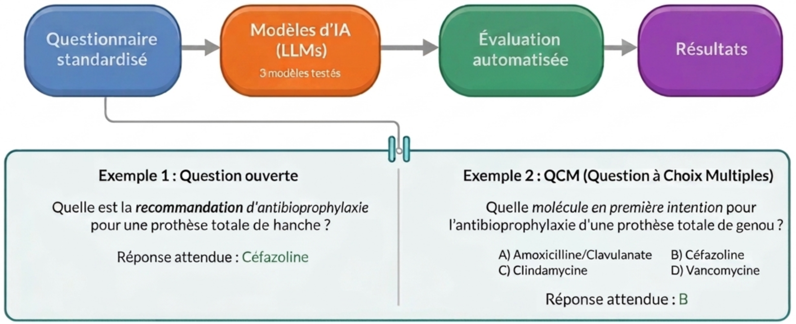
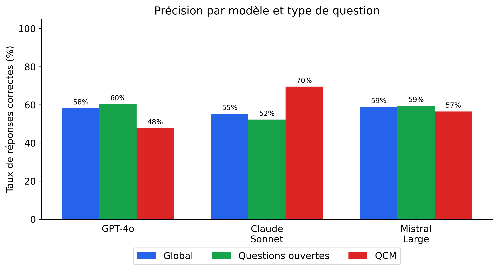

# Abstract SFAR 2026 — Brouillon

> **Limite** : 3 500 caractères espaces inclus (hors titre, auteurs, affiliations, images)
> **Statut** : Brouillon v3 — résultats 3 modèles (134 questions, 8 spécialités)

---

## Titre

Évaluation comparative de l'adhérence des grands modèles de langage aux recommandations formalisées d'experts de la SFAR sur l'antibioprophylaxie en chirurgie et médecine interventionnelle : une méthode de test standardisée

---

## Corps de l'abstract

**Introduction**

Les grands modèles de langage (large language models, LLMs) tel que ChatGPT sont envisagés comme outils d'aide à la décision clinique, mais peuvent produire des réponses incorrectes formulées avec assurance (« hallucinations ») (1), un risque pour la sécurité des patients lorsqu'il s'agit de posologies ou de choix de molécules (2). Leur fiabilité sur des recommandations formalisées d'experts (RFE) reste peu évaluée. L'objectif de cette étude est de proposer une méthode d'évaluation reproductible pour mesurer la fiabilité de plusieurs LLM sur les RFE concernant l'antibioprophylaxie en chirurgie et médecine interventionnelle, émises par la SFAR en 2024 (3).

**Matériel et méthodes**

Un jeu de 134 questions/réponses standardisées (111 questions ouvertes, 23 QCM) a été construit à partir des RFE SFAR 2024 (V2.0, 22/05/2024), couvrant l'ensemble des spécialités concernées par les recommandations.

Trois modèles commerciaux ont été évalués : Mistral Large (Mistral AI), GPT-4o (OpenAI) et Claude Sonnet 4.5 (Anthropic), dans des conditions identiques et reproductibles (Figure 1). Le code est écrit en Python 3.12 et utilise la bibliothèque LiteLLM pour interroger les modèles via les interfaces de programmation de chaque fournisseur. La correction est automatisée : correspondance exacte pour les QCM, correspondance normalisée (insensibilité à la casse) pour les questions ouvertes. Le critère de jugement principal est le taux de réponses correctes. L'ensemble du code et des données est publié en accès libre (4).

**Résultats**

Les trois modèles obtiennent des taux de réponses correctes proches : Mistral Large 59 % (79/134), GPT-4o 58 % (78/134) et Claude Sonnet 55 % (74/134), mais avec des profils distincts (Figure 2). Claude Sonnet est le plus performant sur les QCM (70 % vs 57 % et 48 %), tandis que GPT-4o et Mistral Large obtiennent de meilleurs résultats sur les questions ouvertes (60 % et 59 % vs 52 %). L'exécution complète (402 requêtes) a duré environ 14 minutes sur un ordinateur portable personnel.

**Discussion**

Un taux de moins de 60 % est insuffisant pour un usage clinique sans supervision. Ce résultat, obtenu en interrogeant les modèles « à froid » (sans accès au texte des RFE), constitue un point de comparaison de base. Des techniques de réduction des hallucinations existent, notamment la génération augmentée par recherche documentaire (RAG), qui alimente le modèle avec les passages pertinents des recommandations (5), ou l'injection du texte intégral dans la requête. L'architecture modulaire du code permet de tester ces approches sur le même jeu de questions.

**Conclusion**

Trois modèles d'IA commerciaux ont été évalués sur 134 questions d'antibioprophylaxie issues des RFE SFAR 2024 : aucun ne dépasse 60 % de réponses correctes lorsqu'il est interrogé sans accès au texte des recommandations. Ce jeu de test, publié en accès libre (4), fournit une base de comparaison pour évaluer les approches augmentées susceptibles d'améliorer leur fiabilité.

**Références**

1. Sallam M. Interact J Med Res. 2025;14:e59823.
2. Bedi S et al. npj Digit Med. 2025;8:279.
3. SFAR, SPILF. RFE Antibioprophylaxie. V2.0, 22/05/2024. sfar.org
4. github.com/tomboulier/antibioprophylaxie-LLM-benchmark
5. Kohandel Gargari O et al. Digit Health. 2025;11:20552076251337177.

---

## Décompte

2 895 caractères (corps + références). 605 de marge.

## Notes pour les co-auteurs

- **À relire en priorité** : les 134 questions dans `datasets/sfar_antibioprophylaxie/benchmark.md` (réponses correctes ? cas manquants ?)
- **Anonymat** : le corps du texte ne doit pas mentionner de nom de centre, de ville ou d'auteur
- **Figures** : voir ci-dessous

---

## Figures

**Figure 1.** Méthode d'évaluation. Un questionnaire standardisé de 134 questions couvrant 8 spécialités chirurgicales est soumis à trois grands modèles de langage, puis corrigé automatiquement par comparaison aux réponses attendues issues des RFE SFAR 2024.

**Figure 2.** Taux de réponses correctes par modèle et par type de question (questions ouvertes et QCM). Les trois modèles obtiennent des scores globaux proches (55 à 59 %), mais avec des profils distincts selon le type de question.

