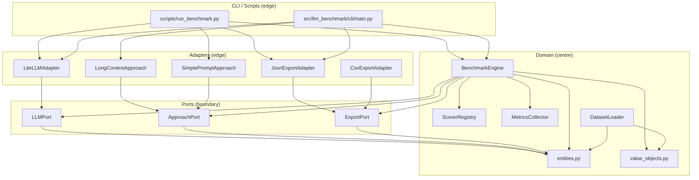

# Architecture Reference

## Overview

`llm-benchmark` follows **hexagonal architecture** (also called Ports & Adapters).
The domain layer is the centre; all external concerns (LLM providers, file I/O, CLI) live
at the edges and communicate with the domain through explicit port interfaces.

---

## Layer Diagram



---

## Layer Descriptions

### Domain (`src/llm_benchmark/domain/`)

The core of the application. Contains all business logic and domain entities.

**Zero external dependencies** — only Python stdlib is allowed here.

| Module | Responsibility |
|---|---|
| `entities.py` | Dataclasses: `Question`, `Dataset`, `RunResult`, `RunSummary`, etc. |
| `value_objects.py` | Immutable value types: `ModelId`, `Accuracy`, `Cost`, `Latency`, etc. |
| `engine.py` | `BenchmarkEngine` — orchestrates (approach × LLM) runs |
| `scorer.py` | `ScorerRegistry` — evaluates LLM answers against expected answers |
| `metrics.py` | `MetricsCollector` — computes cost and carbon from token counts |
| `dataset_loader.py` | `DatasetLoader` / `load_dataset()` — loads and validates dataset JSON |
| `exceptions.py` | Domain-specific exceptions |

### Ports (`src/llm_benchmark/ports/`)

Abstract interfaces (Python ABCs) that define contracts between the domain and adapters.
The domain depends on ports; adapters implement them.

| Port | Implemented by |
|---|---|
| `LLMPort` | `LiteLLMAdapter` |
| `ApproachPort` | `LongContextApproach`, `SimplePromptApproach` |
| `ExportPort` | `JsonExportAdapter`, `CsvExportAdapter` |

### Adapters (`src/llm_benchmark/adapters/`)

Concrete implementations of ports. Each adapter may import external libraries.

| Adapter | External dependency |
|---|---|
| `LiteLLMAdapter` | `litellm` |
| `LongContextApproach` | none (stdlib only) |
| `SimplePromptApproach` | none (stdlib only) |
| `JsonExportAdapter` | none (stdlib only) |
| `CsvExportAdapter` | none (stdlib only) |

**Registries** (`adapters/llms/__init__.py`, `adapters/approaches/__init__.py`) load
available adapters from `config/models.yaml` and expose them as dicts for CLI/script use.

### CLI / Scripts (edge)

Thin entry points. Their only job is:
1. Parse arguments
2. Resolve adapters from registries
3. Call `BenchmarkEngine.run()`
4. Export results via an `ExportPort` adapter
5. Print human-readable output

They contain **no business logic**.

---

## Dependency Rules

| Layer | May import from | Must NOT import from |
|---|---|---|
| `domain/` | `domain/` (stdlib only) | `ports/`, `adapters/`, `cli/`, `scripts/`, any third-party lib |
| `ports/` | `domain/` | `adapters/`, `cli/`, `scripts/` |
| `adapters/` | `ports/`, `domain/`, third-party libs | `cli/`, `scripts/` |
| `cli/` | `adapters/`, `ports/`, `domain/` | `scripts/` |
| `scripts/` | `adapters/`, `ports/`, `domain/`, `cli/` | provider SDKs directly (`anthropic`, `openai`, `mistralai`, etc.) |

**The golden rule**: dependencies point inward. Outer layers depend on inner layers, never
the reverse.

---

## Correct vs Incorrect Patterns

### LLM calls

```python
# CORRECT — route through LiteLLMAdapter via LLMPort
from llm_benchmark.adapters.llms import LLM_REGISTRY
adapter = LLM_REGISTRY["gpt-4o"]
response = adapter.complete(request)

# INCORRECT — direct provider SDK import
import openai
client = openai.OpenAI()
response = client.chat.completions.create(...)
```

### Scoring

```python
# CORRECT — delegate to BenchmarkEngine (which uses ScorerRegistry internally)
engine = BenchmarkEngine()
results = engine.run(dataset, [approach], [llm_adapter])

# INCORRECT — inline scoring in a script or adapter
def score_qcm(expected, actual):
    ...
```

### Model registry

```python
# CORRECT — single source of truth
from llm_benchmark.adapters.llms import LLM_REGISTRY
available_models = sorted(LLM_REGISTRY.keys())

# INCORRECT — hardcoded dict in a script
MODELS = {
    "gpt-4o": ("openai", "gpt-4o"),
    ...
}
```

### Result export

```python
# CORRECT — use JsonExportAdapter
from llm_benchmark.adapters.exports.json_export import JsonExportAdapter
path = JsonExportAdapter().export(run_result, output_dir)

# INCORRECT — write custom JSON directly
import json
path.write_text(json.dumps({"model_name": ..., "results": ...}))
```

### Dataset loading

```python
# CORRECT — use DatasetLoader
from llm_benchmark.domain.dataset_loader import load_dataset
dataset = load_dataset(Path("datasets/sfar_antibioprophylaxie/benchmark.json"))

# INCORRECT — raw JSON parsing in a script
import json
data = json.loads(Path("research/benchmark.json").read_text())
questions = data["questions"]
```

---

## Adding a New LLM Provider

1. Add the model to `config/models.yaml` with pricing.
2. `LLM_REGISTRY` picks it up automatically at import time — no code change needed.
3. If LiteLLM does not support the provider, implement a new class that extends `LLMPort`
   in `src/llm_benchmark/adapters/llms/` and register it manually in `__init__.py`.

## Adding a New Approach

1. Create a new class in `src/llm_benchmark/adapters/approaches/` that extends `ApproachPort`.
2. Register it in `src/llm_benchmark/adapters/approaches/__init__.py`.
3. The CLI and scripts resolve approaches by string ID from `APPROACH_REGISTRY`.

---

## Évolutions prévues

L'architecture actuelle supporte le POC (Epic 1 du PRD : scoring binaire, simple prompt + long context, 2+ modèles). Les Epics suivantes nécessiteront des évolutions du modèle de données et des scorers, sans toucher à la structure hexagonale :

- **Epic 2 (dataset enrichi)** : ajouter `difficulty`, `clinical_impact`, `explanation`, `scoring_criteria` à `Question`. Ajouter une table de synonymes chargée depuis un fichier de config.
- **Epic 3 (scoring multi-critères)** : faire évoluer `ScoreResult` d'un booléen `is_correct` vers un score pondéré 0.0-1.0 avec détail par critère. Ajouter un `MultiCriteriaScorer` dans le `ScorerRegistry`.
- **Epic 4 (approches avancées)** : ajouter des adaptateurs `ApproachPort` pour RAG-PDF, RAG-structuré, MCP. Aucun changement au domaine.
- **Epic 5 (métriques)** : implémenter `CsvExportAdapter`, brancher `CarbonFootprint` (actuellement `None` dans `RunSummary`).
- **Epic 6 (publication)** : ajouter `scripts/eval_results.py` pour la génération du rapport.
