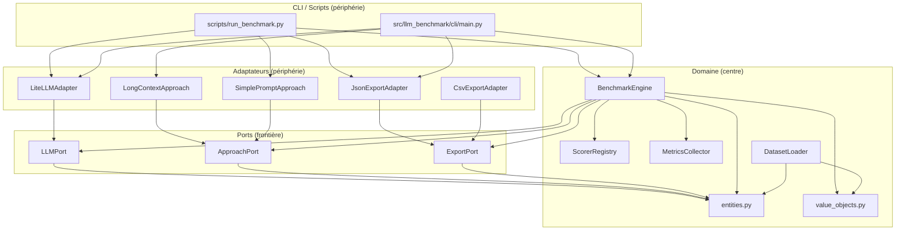

# Référence d'architecture

## Vue d'ensemble

`llm-benchmark` suit une **architecture hexagonale** (aussi appelée Ports & Adaptateurs).
La couche domaine est au centre ; toutes les préoccupations externes (fournisseurs LLM, I/O fichiers, CLI) se trouvent en périphérie et communiquent avec le domaine via des interfaces de port explicites.

---

## Diagramme des couches



---

## Description des couches

### Domaine (`src/llm_benchmark/domain/`)

Le coeur de l'application. Contient toute la logique métier et les entités du domaine.

**Zéro dépendance externe** : seule la bibliothèque standard Python est autorisée ici.

| Module | Responsabilité |
|---|---|
| `entities.py` | Dataclasses : `Question`, `Dataset`, `RunResult`, `RunSummary`, etc. |
| `value_objects.py` | Types valeur immuables : `ModelId`, `Accuracy`, `Cost`, `Latency`, etc. |
| `engine.py` | `BenchmarkEngine` : orchestre les runs (approche x LLM) |
| `scorer.py` | `ScorerRegistry` : évalue les réponses LLM par rapport aux réponses attendues |
| `metrics.py` | `MetricsCollector` : calcule le coût et le carbone à partir du nombre de tokens |
| `dataset_loader.py` | `DatasetLoader` / `load_dataset()` : charge et valide le dataset JSON |
| `exceptions.py` | Exceptions spécifiques au domaine |

### Ports (`src/llm_benchmark/ports/`)

Interfaces abstraites (ABCs Python) qui définissent les contrats entre le domaine et les adaptateurs.
Le domaine dépend des ports ; les adaptateurs les implémentent.

| Port | Implémenté par |
|---|---|
| `LLMPort` | `LiteLLMAdapter` |
| `ApproachPort` | `LongContextApproach`, `SimplePromptApproach` |
| `ExportPort` | `JsonExportAdapter`, `CsvExportAdapter` |

### Adaptateurs (`src/llm_benchmark/adapters/`)

Implémentations concrètes des ports. Chaque adaptateur peut importer des bibliothèques externes.

| Adaptateur | Dépendance externe |
|---|---|
| `LiteLLMAdapter` | `litellm` |
| `LongContextApproach` | aucune (stdlib uniquement) |
| `SimplePromptApproach` | aucune (stdlib uniquement) |
| `JsonExportAdapter` | aucune (stdlib uniquement) |
| `CsvExportAdapter` | aucune (stdlib uniquement) |

**Registres** (`adapters/llms/__init__.py`, `adapters/approaches/__init__.py`) : chargent
les adaptateurs disponibles depuis `config/models.yaml` et les exposent sous forme de dicts pour la CLI/les scripts.

### CLI / Scripts (périphérie)

Points d'entrée légers. Leur seul rôle :
1. Parser les arguments
2. Résoudre les adaptateurs depuis les registres
3. Appeler `BenchmarkEngine.run()`
4. Exporter les résultats via un adaptateur `ExportPort`
5. Afficher la sortie lisible

Ils ne contiennent **aucune logique métier**.

---

## Règles de dépendance

| Couche | Peut importer depuis | Ne doit PAS importer depuis |
|---|---|---|
| `domain/` | `domain/` (stdlib uniquement) | `ports/`, `adapters/`, `cli/`, `scripts/`, toute lib tierce |
| `ports/` | `domain/` | `adapters/`, `cli/`, `scripts/` |
| `adapters/` | `ports/`, `domain/`, libs tierces | `cli/`, `scripts/` |
| `cli/` | `adapters/`, `ports/`, `domain/` | `scripts/` |
| `scripts/` | `adapters/`, `ports/`, `domain/`, `cli/` | SDKs fournisseurs directement (`anthropic`, `openai`, `mistralai`, etc.) |

**La règle d'or** : les dépendances pointent vers l'intérieur. Les couches externes dépendent des couches internes, jamais l'inverse.

---

## Patterns corrects vs incorrects

### Appels LLM

```python
# CORRECT : passer par LiteLLMAdapter via LLMPort
from llm_benchmark.adapters.llms import LLM_REGISTRY
adapter = LLM_REGISTRY["gpt-4o"]
response = adapter.complete(request)

# INCORRECT : import direct du SDK fournisseur
import openai
client = openai.OpenAI()
response = client.chat.completions.create(...)
```

### Scoring

```python
# CORRECT : déléguer au BenchmarkEngine (qui utilise ScorerRegistry en interne)
engine = BenchmarkEngine()
results = engine.run(dataset, [approach], [llm_adapter])

# INCORRECT : scoring en ligne dans un script ou un adaptateur
def score_qcm(expected, actual):
    ...
```

### Registre de modèles

```python
# CORRECT : source de vérité unique
from llm_benchmark.adapters.llms import LLM_REGISTRY
available_models = sorted(LLM_REGISTRY.keys())

# INCORRECT : dict codé en dur dans un script
MODELS = {
    "gpt-4o": ("openai", "gpt-4o"),
    ...
}
```

### Export de résultats

```python
# CORRECT : utiliser JsonExportAdapter
from llm_benchmark.adapters.exports.json_export import JsonExportAdapter
path = JsonExportAdapter().export(run_result, output_dir)

# INCORRECT : écrire du JSON directement
import json
path.write_text(json.dumps({"model_name": ..., "results": ...}))
```

### Chargement du dataset

```python
# CORRECT : utiliser DatasetLoader
from llm_benchmark.domain.dataset_loader import load_dataset
dataset = load_dataset(Path("datasets/sfar_antibioprophylaxie/benchmark.json"))

# INCORRECT : parsing JSON brut dans un script
import json
data = json.loads(Path("research/benchmark.json").read_text())
questions = data["questions"]
```

---

## Ajouter un nouveau fournisseur LLM

1. Ajouter le modèle dans `config/models.yaml` avec les tarifs.
2. `LLM_REGISTRY` le détecte automatiquement à l'import : aucun changement de code nécessaire.
3. Si LiteLLM ne supporte pas le fournisseur, implémenter une nouvelle classe qui étend `LLMPort`
   dans `src/llm_benchmark/adapters/llms/` et l'enregistrer manuellement dans `__init__.py`.

## Ajouter une nouvelle approche

1. Créer une nouvelle classe dans `src/llm_benchmark/adapters/approaches/` qui étend `ApproachPort`.
2. L'enregistrer dans `src/llm_benchmark/adapters/approaches/__init__.py`.
3. La CLI et les scripts résolvent les approches par identifiant string depuis `APPROACH_REGISTRY`.

---

## Évolutions prévues

L'architecture actuelle supporte le POC (Epic 1 du PRD : scoring binaire, simple prompt + long context, 2+ modèles). Les Epics suivantes nécessiteront des évolutions du modèle de données et des scorers, sans toucher à la structure hexagonale :

- **Epic 2 (dataset enrichi)** : ajouter `difficulty`, `clinical_impact`, `explanation`, `scoring_criteria` à `Question`. Ajouter une table de synonymes chargée depuis un fichier de config.
- **Epic 3 (scoring multi-critères)** : faire évoluer `ScoreResult` d'un booléen `is_correct` vers un score pondéré 0.0-1.0 avec détail par critère. Ajouter un `MultiCriteriaScorer` dans le `ScorerRegistry`.
- **Epic 4 (approches avancées)** : ajouter des adaptateurs `ApproachPort` pour RAG-PDF, RAG-structuré, MCP. Aucun changement au domaine.
- **Epic 5 (métriques)** : implémenter `CsvExportAdapter`, brancher `CarbonFootprint` (actuellement `None` dans `RunSummary`).
- **Epic 6 (publication)** : ajouter `scripts/eval_results.py` pour la génération du rapport.
